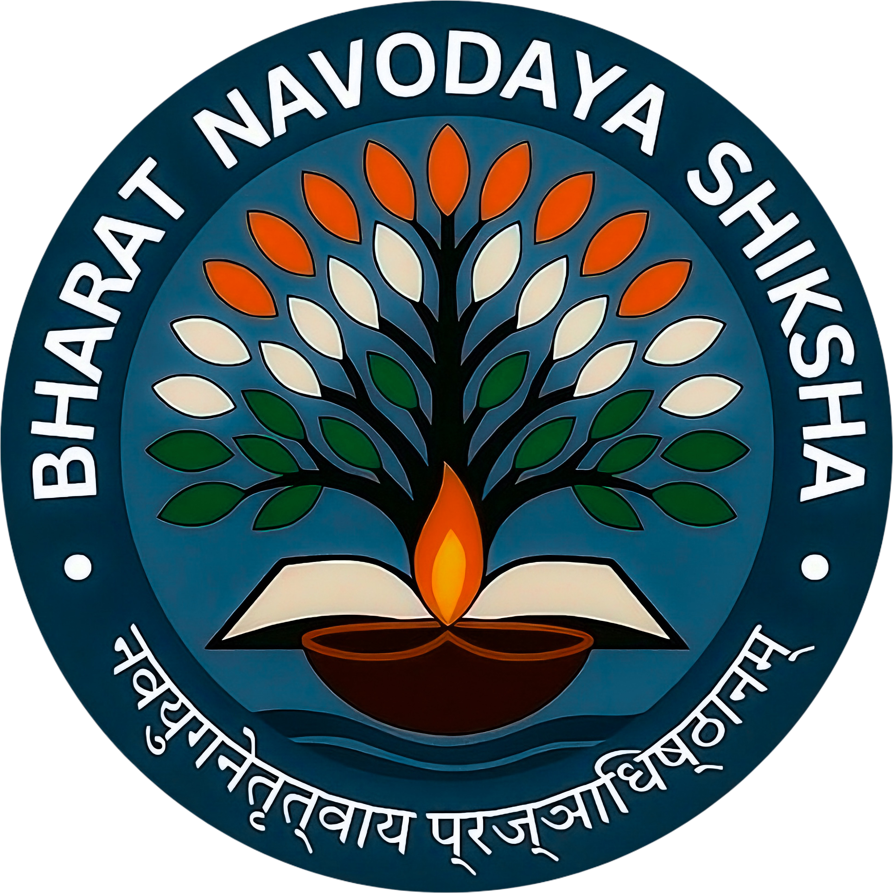

# Bharat Navodaya Shiksha (BNS)



## Project Overview

Bharat Navodaya Shiksha (BNS) is a comprehensive educational platform designed to empower students with quality education and career guidance. The application serves as a bridge between students, educators, and educational resources, providing easy access to courses, learning materials, and academic support.

## Features

- **User Authentication**: Secure login and signup system with role-based access control
- **Learning Portal**: Access to courses, study materials, and educational resources
- **Dashboard**: Personalized dashboard for students and educators
- **Dark Mode**: Full dark mode support across all pages for better visibility
- **Course Management**: Browse, enroll, and track progress in various courses
- **Subscription Plans**: Silver, Gold, and Diamond subscription tiers with different benefits
- **Scholarship Information**: Details about available scholarships and application process
- **Event Management**: Information about upcoming educational events
- **Practice Section**: Interactive practice exercises and quizzes
- **Meeting Scheduler**: Tool to schedule meetings with educators
- **Student Management**: Add, view, and manage student records
- **Reports**: Generate and view various reports on academic performance

## Technology Stack

- **Frontend**: React.js with Vite
- **Styling**: Tailwind CSS with custom CSS
- **State Management**: React Context API
- **Routing**: React Router
- **Icons**: React Icons
- **Build Tool**: Vite

## Getting Started

### Prerequisites

- Node.js (v14.0.0 or later)
- npm or yarn

### Installation

1. Clone the repository:
   ```bash
   git clone https://github.com/yourusername/BHARAT_NAVODAYA_SHIKSHA.git
   cd BHARAT_NAVODAYA_SHIKSHA
   ```

2. Install dependencies:
   ```bash
   npm install
   # or
   yarn
   ```

3. Start the development server:
   ```bash
   npm run dev
   # or
   yarn dev
   ```

4. Open your browser and navigate to:
   ```
   http://localhost:5173
   ```

## Project Structure

```
src/
  ├─ App.jsx              # Main application component
  ├─ main.jsx             # Entry point
  ├─ assets/              # Static assets
  ├─ components/          # Reusable components
  │   ├─ Header.jsx       # Navigation header
  │   ├─ Footer.jsx       # Page footer
  │   └─ DarkModeToggle.jsx # Dark mode switcher
  ├─ context/             # React context providers
  │   └─ DarkModeContext.jsx # Dark mode state management
  └─ pages/               # Application pages
      ├─ LandingPage.jsx  # Home page
      ├─ Dashboard.jsx    # User dashboard
      ├─ Login.jsx        # Authentication
      └─ ...              # Other page components
```

## Available Scripts

- `npm run dev` - Start development server
- `npm run build` - Build for production
- `npm run lint` - Run ESLint
- `npm run preview` - Preview production build locally

## Contributing

We welcome contributions to improve the Bharat Navodaya Shiksha platform. Please follow these steps:

1. Fork the repository
2. Create a feature branch (`git checkout -b feature/amazing-feature`)
3. Commit your changes (`git commit -m 'Add some amazing feature'`)
4. Push to the branch (`git push origin feature/amazing-feature`)
5. Open a Pull Request

## License

This project is licensed under the MIT License - see the LICENSE file for details.

## Acknowledgments

- React Team for the amazing library
- Vite Team for the fast development environment
- All contributors who have helped build this platform
